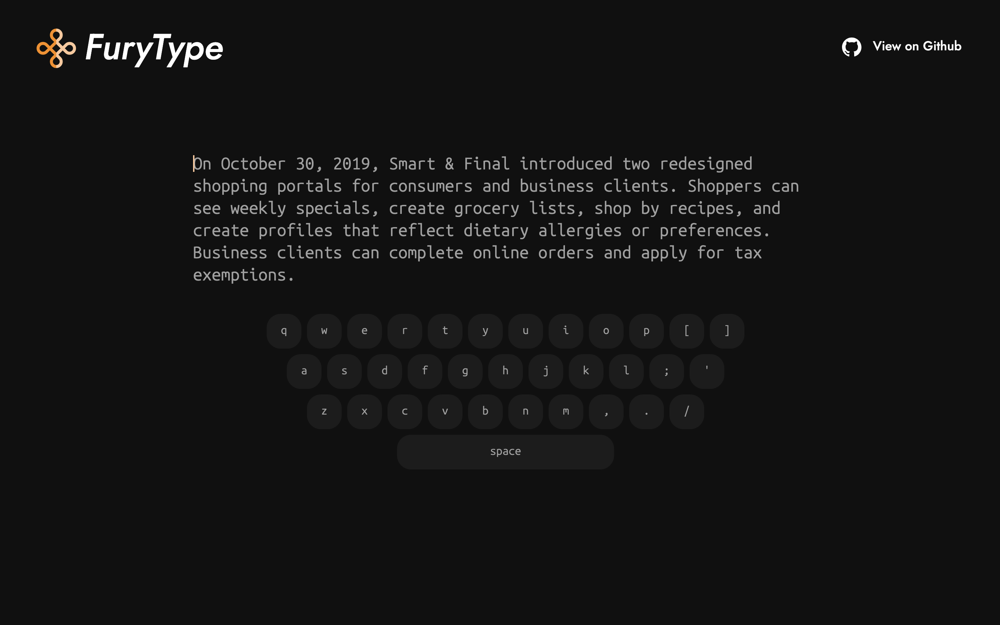
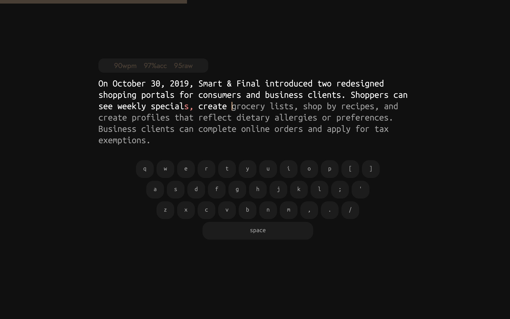
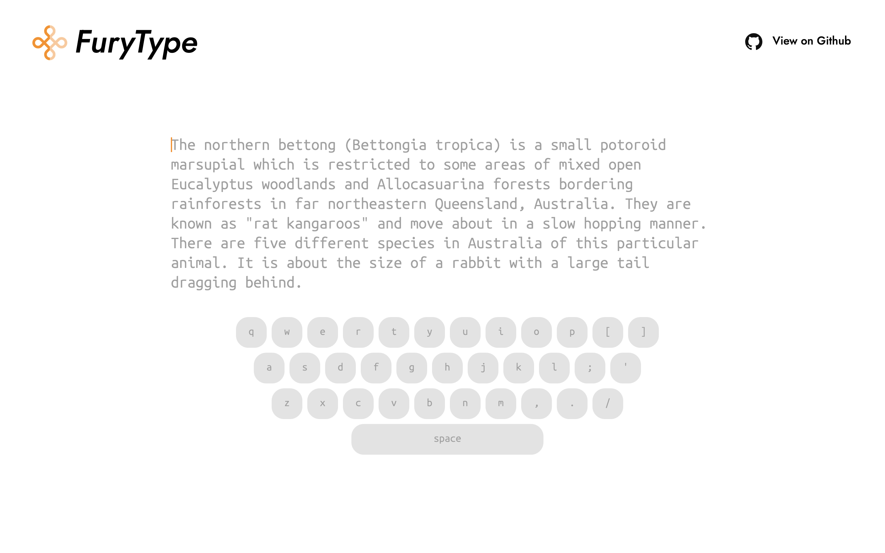
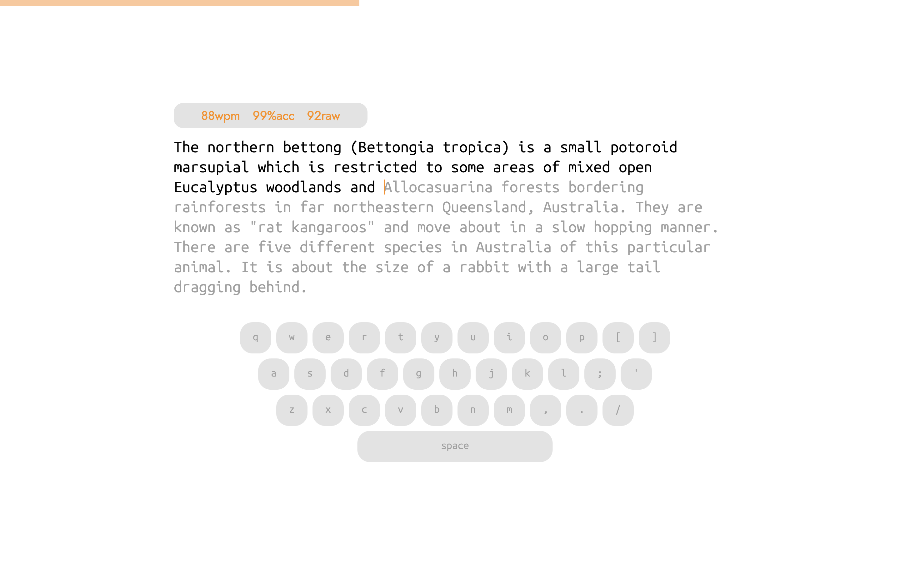

  

    

<a href="https://furytype.voltcrash.com"><em> a simple typing practice platform</em></a>

 

Welcome to FuryType, a website where you can test, practice and improve your typing speed.
 
With a simple no-nonsense UI, you can quickly jump on doing what matters the most - Typing.
## Themes 🎨
FuryType offers two visually appealing and comfortable themes inspired by <a href="https://github.com/raunofreiberg/vesper"><em>vesper</em></a>, designed to be easy on the eyes.

### Dark Theme (default)

### Light Theme

## Technologies Used 🛠️

- **Vite** - Frontend build tool
- **Bun** - JavaScript runtime and package manager.
- **TypeScript** - Animations and typing logic.
- **HTML** - Web page structure.
- **CSS** - Site styling and design.
