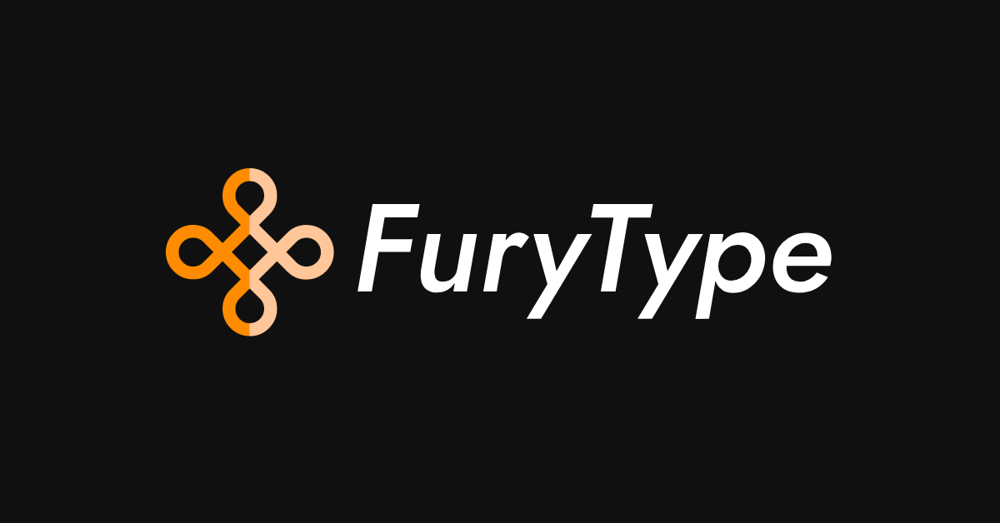
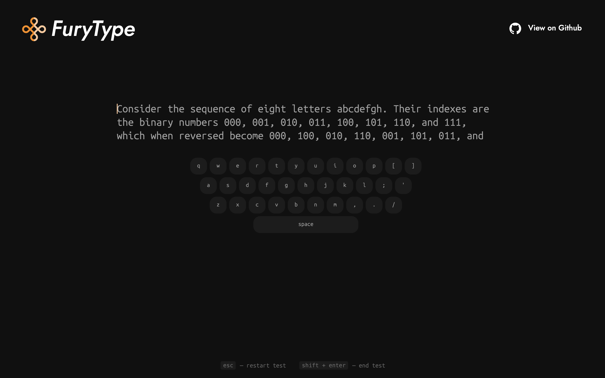
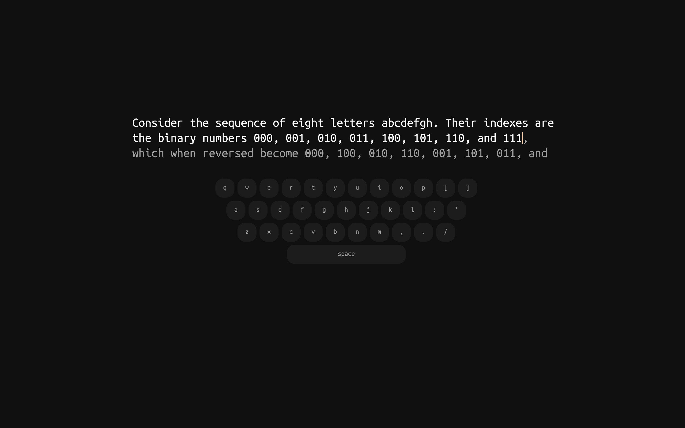
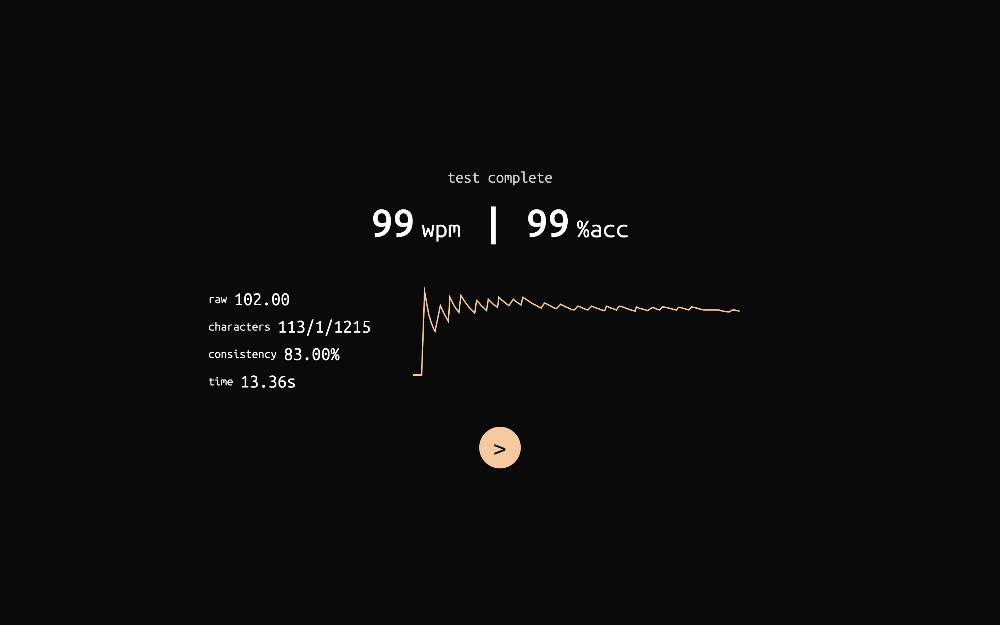
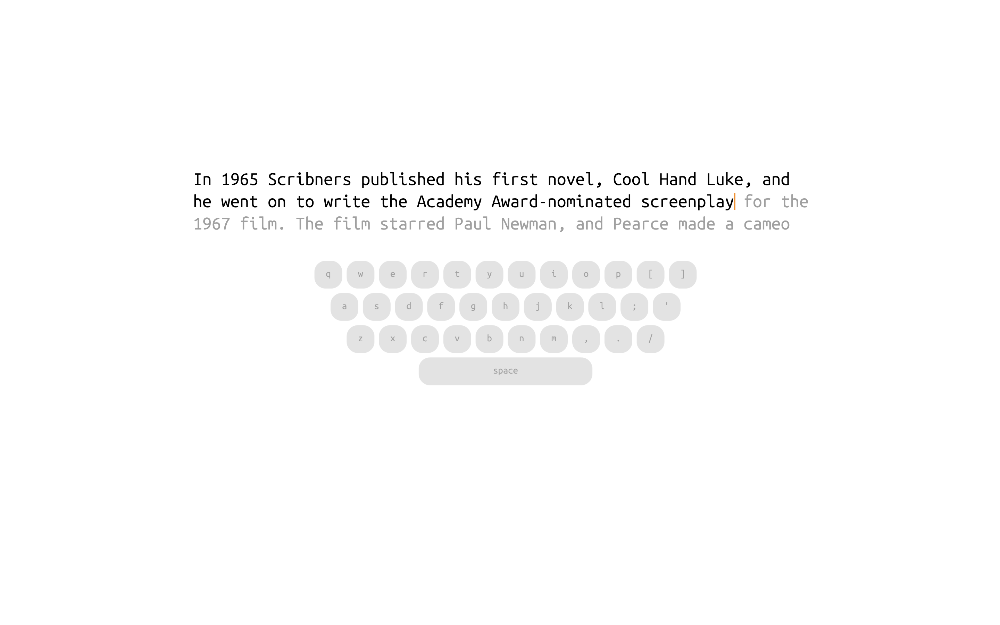
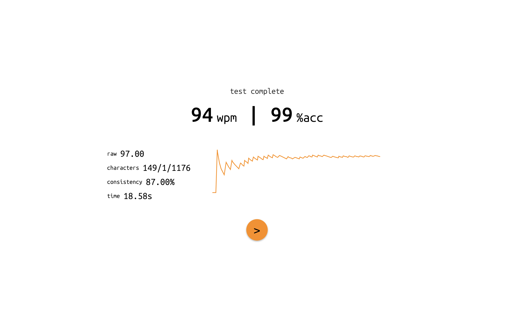

  

    

<a href="https://furytype.voltcrash.com"><em>Endless Typing Test & Practice Platform</em></a>

 

Welcome to FuryType, a website where you can test, practice and improve your typing speed.
 
With a simple no-nonsense UI, you can quickly jump on doing what matters the most - Typing.

## Features
- **Endless Typing Mode**: Practice without pressure - no timers, no interruptions. Type for as long as you like, and simply press <kbd>Shift</kbd> + <kbd>Enter</kbd> to view your detailed typing stats.
- **Minimalist, Distraction-Free UI**: Focus solely on your typing with a clean, clutter-free interface and visually appealing [themes](##Themes) designed for productivity.
- **Challenging, Real-World Texts**: Hone your skills with carefully curated passages from Wikipedia, offering a balanced mix of letters, numbers, and punctuation to challenge even advanced typists.

## Themes 🎨
FuryType offers two visually appealing and comfortable themes inspired by <a href="https://github.com/raunofreiberg/vesper"><em>vesper</em></a>, designed to be easy on the eyes.

### Dark Theme (default)

## Technologies Used 🛠️

- **Vite** - Frontend build tool
- **Bun** - JavaScript runtime and package manager.
- **TypeScript** - Animations and typing logic.
- **HTML** - Web page structure.
- **CSS** - Site styling and design.
